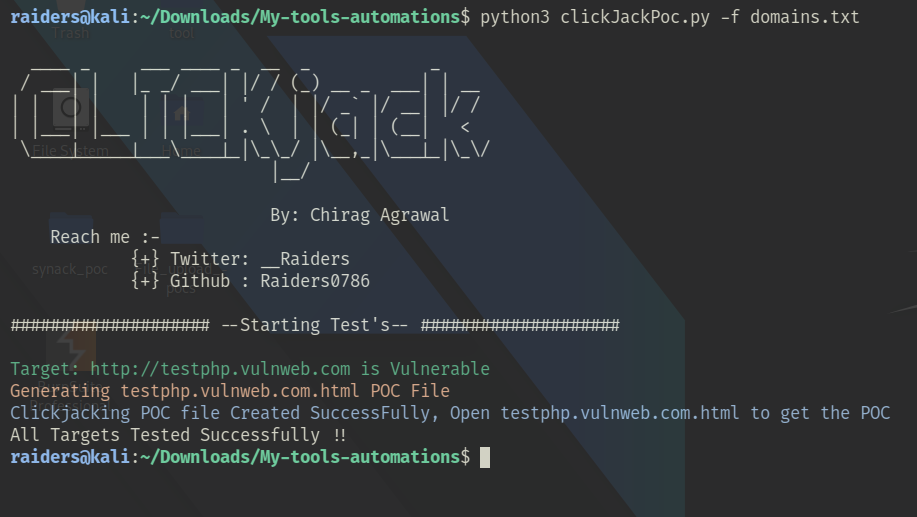

# ClickJackPoc

- This tool will help you automate finding Clickjacking Vulnerability by just passing a file containing list of Targets .
- Once the Target is Found Vulnerable It will generate the Exploit Proof of Conepet(PoC) for each Vulnerable targets.

## What is Clickjacking ?

- Clickjacking (User Interface redress attack, UI redress attack, UI redressing) is a malicious technique of tricking a Web user into clicking on something different from what the user perceives they are clicking on, thus potentially revealing confidential information or taking control of their computer while clicking on seemingly innocuous web pages.
- The server didn't return an X-Frame-Options header which means that this website could be at risk of a clickjacking attack. The X-Frame-Options HTTP response header can be used to indicate whether or not a browser should be allowed to render a page in a <frame> or <iframe>. 
- Sites can use "X-Frame-Options" in the headers to avoid clickjacking attacks by ensuring that their content is not embedded into other sites.
- [Reference](https://owasp.org/www-community/attacks/Clickjacking)

## Features:
- It will take all the targets from the file passed.
- Make the exploit Poc by creating a HTML File with `TargetName.html` as the Output.
- Will Print `Not Vulnerable` if Target is not Vulnerable.
- Multi Threading Support Added.
- Integrated `Slack Alert` with PoC Code.
- Script will now store all the respective PoC code in `results` folder with respective name.

## Installation:
````
git clone https://github.com/Raiders0786/ClickjackPoc.git
cd ClickjackPoc
pip install -r requirements.txt
````

## Example:
Example Usage of the Tool
````
python3 clickJackPoc.py -f domains.txt
````



## Allowed Targets Format:

````
http://target.com
target.com
www.target.com
https://tartget.com/
https://IP:Port
IP:Port
http://IP:Port/login
http://www.target.com/directory
https://www.target.com/directory
````

## Reach Me :
- `Do Tag Me if you get Rewarded💸💰 , Will be Very Happy to hear that 😄 !`
- Do Give it a `Star` if you like it & `Follow` me for more such stuffs!
- Let me know if you have any Suggestion's or want to Collaborate.
- This tool is made for Learning Purpose ! 


<a href="https://www.linkedin.com/in/chirag-agrawal-770488144/" target="_blank"></a>

